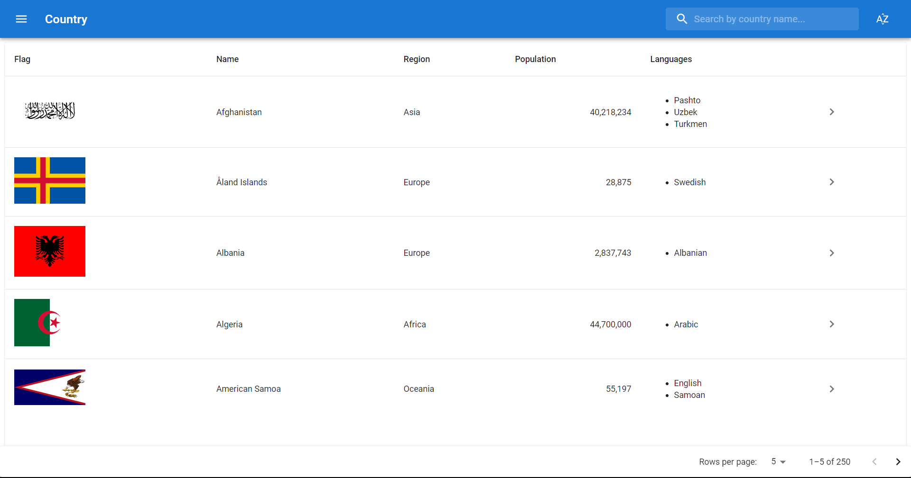
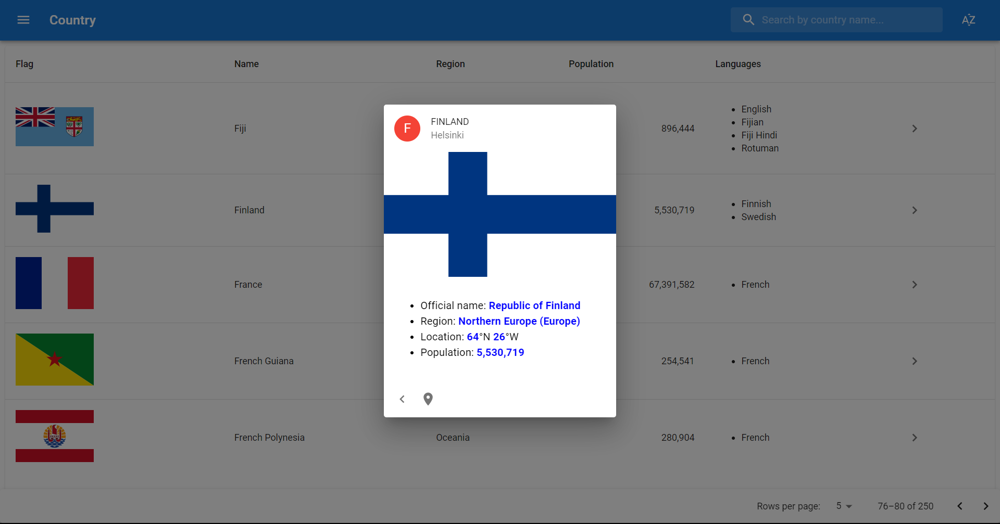

# React Country Information App

This project is a React-based web application that displays country information using the REST Countries API. It showcases understanding of basic React concepts, componentization, and advanced features such as TypeScript, custom hooks, and Material UI.

Live preview: https://phuongnh-countryreact.netlify.app/

## Features

- Display a list of countries with pagination
- Search for countries by name
- View detailed information about a selected country
- Sort countries by name
- Utilize advanced React concepts, TypeScript, and Material UI
- Optimize the application using useCallback, useMemo, and debounce
- Implement state management with Redux

## Setup and Installation

1.  Clone the repository:

`git clone https://github.com/your-username/react-country-information-app.git`

2.  Change directory to the project folder:

`cd react-country-information-app`

3.  Install the required dependencies:

`npm install`

## Usage

To run the development server, use the following command:

`npm start`

The application will be available at [http://localhost:3000](http://localhost:3000/).

## Technologies Used

- React
- TypeScript
- Material UI
- Redux Toolkit
- REST Countries API
- React Router
- Custom Hooks
- useCallback, useMemo, and debounce
